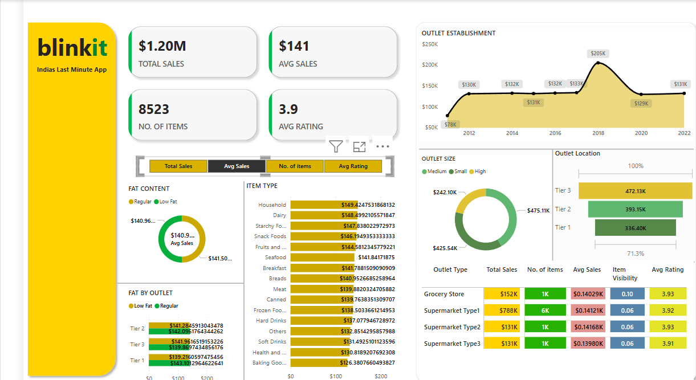

# 🛒 Blinkit Sales Analysis Dashboard (Power BI)

This repository contains an interactive sales analysis dashboard built using **Power BI** for Blinkit – *India’s Last Minute App*. The dashboard is designed to provide key insights into sales performance, item distribution, outlet characteristics, and customer preferences based on the dataset.

---

## 📊 Dashboard Highlights

### 💡 Key Metrics
- **Total Sales:** $1.20M
- **Average Sales per Item:** $141
- **Total Number of Items:** 8,523
- **Average Rating:** 3.9 / 5

---

### 📈 Visual Insights

- **Outlet Establishment Over Time:** Sales trend from 2012 to 2022 showing key growth years and fluctuations.
- **Outlet Size Distribution:** Sales split across Small, Medium, and High outlet sizes.
- **Outlet Location Performance:** Tier-wise sales breakdown and visibility.
- **Item Type Analysis:** Comparison of average sales by item category (e.g., Household, Dairy, Snacks, etc.).
- **Fat Content Insights:** Sales split between Regular and Low Fat items.
- **Outlet Type Breakdown:** Grocery Store vs. different Supermarket types with metrics like total sales, item count, visibility score, and average rating.

---

## 🛠 Tools & Technologies

- **Power BI:** Used for building interactive visualizations and data storytelling.
- **Data Modeling:** Applied filters, slicers, and DAX formulas for custom insights.
- **Design:** Used card visuals, bar charts, donut charts, line graphs, and tables for intuitive presentation.

---

## 📂 Dataset

The analysis is based on a dataset containing Blinkit's sales transactions, item properties, outlet details, and customer ratings. Data cleaning and transformation were performed within Power BI.

---

## 🎯 Objective

The goal of this project is to:
- Gain meaningful insights into Blinkit's sales performance.
- Understand consumer behavior across regions and outlet types.
- Identify top-performing product categories.
- Support data-driven decision-making for marketing and inventory management.

---

## 📷 Dashboard Preview

---

## 📌 Author

**Kritika Saha**  
Aspiring Data/Business Analyst | Machine Learning Intern | Data-Driven & Insight-Oriented  
🔗 [LinkedIn](https://www.linkedin.com/in/kritika-saha24/) 

